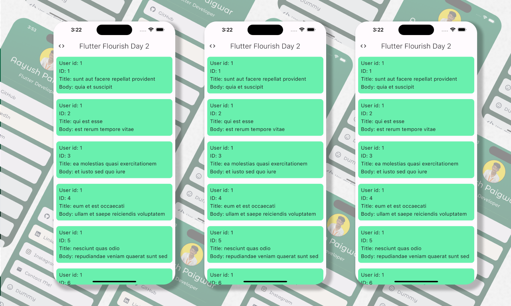

<h2 align="center" style="border-bottom: none">
    <b>
        <a href="https://github.com/AayushPaigwar/GDSC-Flutter-Flourish-D1/">Flutter Flourish</a><br>
    </b>
    ⭐️  A Flutter Begineer's Event Organized by GDSC GHRCE⭐️ <br>
</h2>

[](https://github.com/AayushPaigwar)


# Project - 2 Fetching Data From API's

<p align="center">
  
</p>

## [API Key Link](https://jsonplaceholder.typicode.com/posts)   | [API Testing](https://web.postman.co/)  |  [API Model Generator](https://app.quicktype.io/)

## Step to Use

1. **Download the Project:**
   - Click on the green "Code" button.
   - Select "Download ZIP".
   - Once the ZIP file is downloaded, locate the file in your Downloads folder or the chosen download location.

3. **Extract the Project:**
   - Right-click on the downloaded ZIP file.
   - Choose "Extract All..." from the context menu.
   - Select the destination where you want to extract the files.
   - Click "Extract".

4. **Navigate to the Project:**
   - Open the extracted folder in VS Code.

5. **Install Dependencies:**
   - Open Terminal in VS Code using ```Ctrl + J``` / ```cmd + J```
   - Run the following command to install dependencies:

     ```bash
     flutter pub get
     ```

6. **Run the App:**
   - Run the app using the **Start Debugging** button.


## Happy Coding!🚀

---

<div align="center">
  
Made with ❤️ by [Aayush Paigwar](https://github.com/AayushPaigwar)
</div>
